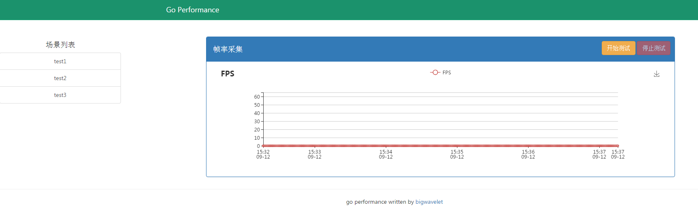

<<<<<<< HEAD

## 概述
goperf是一个基于golang编写的获取android帧率的二进制文件。
一方面：其可以实时获取android设备的帧率并通过web显示；
另一方面：我们点击停止测试后会将相应的帧率数据存入用户指定的文件。

## 使用方法：

1. 编译

    用户可以执行build.sh文件来编译得到二进制文件。

    windows用户也可以下载[goperf.exe](goperf.exe)二进制文件到本地。

2. 服务开启

    确保PC上安装了adb，并需要有一台android设备连接电脑, 打开一个app（如一个游戏app）.
    
    在命令行输入
    
    ```
    goperf.exe --help
    ```
    
    可以查看goperf使用说明
    
    ```
    Flags:
    -h, --help           Show context-sensitive help (also try --help-long and
                        --help-man).
    -p, --port=PORT      listen port, default:2333
    -s, --serial=SERIAL  device serialno.
    -v, --version        Show version
    ```
    
    如果有多台设备连接，我们需要通过-s指定设备；
    
    同时，我们可以通过-p来指定端口，默认为2333.
    例如我们通过如下命令就可以开启goperf服务：
    
    ```
    goperf.exe -p 7777
    ```
    
    
    点击开始测试按钮，就可以开始实时采集帧率。
    
    点击停止测试按钮，并制定文件名称即可停止帧率采集并
    将相应数据存入文件。
    
    点击左侧的场景列表项，可以查看相应场景的fps性能数据。
    
    数据文件储存在./data文件夹下。
    
